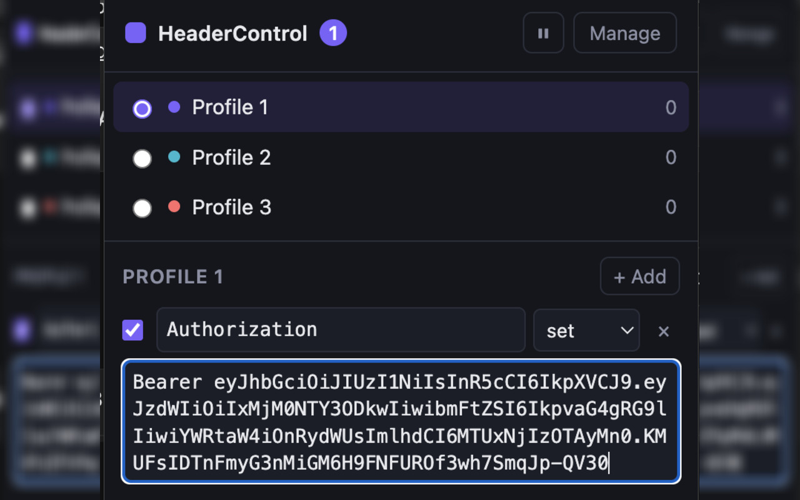

<p align="center">
  
</p>

<h1 align="center">HeaderControl</h1>

<p align="center">
  <strong>Add, override, and remove HTTP request headers — organized into profiles.</strong>
</p>

<p align="center">
  A Manifest V3 Chrome extension built on
  <a href="https://developer.chrome.com/docs/extensions/reference/api/declarativeNetRequest"><code>declarativeNetRequest</code></a>.
  Rules run in Chrome’s network stack — the extension never sits in the request path and never reads your traffic.
</p>

<p align="center">
  <a href="https://chromewebstore.google.com/detail/headercontrol/ljopaddcofbllcmmbajkenhjeegoaclp"></a>
  
  
  <a href="https://subsequent-skateboard-0b8.notion.site/Privacy-Policy-for-HeaderControl-39aec9d0017080e1bf45ed54801ab724"></a>
</p>

<p align="center">
  <a href="https://chromewebstore.google.com/detail/headercontrol/ljopaddcofbllcmmbajkenhjeegoaclp">Chrome Web Store</a>
  ·
  <a href="https://github.com/Ashcroft-lab/HeaderControl">GitHub</a>
  ·
  <a href="https://subsequent-skateboard-0b8.notion.site/Privacy-Policy-for-HeaderControl-39aec9d0017080e1bf45ed54801ab724">Privacy Policy</a>
</p>

---

<p align="center">
  
</p>

## Features

- **Profiles** — named header sets; only one profile is active at a time (or none)
- **Set & remove** — override or strip request headers per profile
- **URL scoping** — apply rules with a DNR `urlFilter` (default `*://*/*`)
- **Domain exclusions** — skip specific hosts (and their use as initiators)
- **Quick edit** — toggle profiles and edit headers from the toolbar popup
- **Full editor** — Options page for filters, exclusions, and bulk management
- **Import / export** — back up or share profiles as JSON
- **Local-only** — everything stays in `chrome.storage`; nothing is sent off-device

Built for developers swapping auth tokens, simulating CDN/backend headers, or debugging without touching server code.

## Install

### Chrome Web Store (recommended)

[**Add HeaderControl from the Chrome Web Store**](https://chromewebstore.google.com/detail/headercontrol/ljopaddcofbllcmmbajkenhjeegoaclp)

Extension ID: `ljopaddcofbllcmmbajkenhjeegoaclp`

### Load unpacked (development)

1. Clone this repo or download a release zip
2. Open `chrome://extensions`
3. Enable **Developer mode**
4. Click **Load unpacked** and select this folder (the one with `manifest.json`)
5. Open the toolbar popup, or right-click → **Options** to manage profiles

When loaded unpacked, `host_permissions: <all_urls>` is granted with the install, so enabled profiles apply immediately.

## How it works

```
Edit profile (popup / options)
        │
        ▼
 chrome.storage.local
        │  onChanged
        ▼
 background service worker
        │  compileRules()
        ▼
 declarativeNetRequest dynamic rules
        │
        ▼
 Chrome network stack enforces headers
```

After rules are installed, the service worker does not need to stay awake — Chrome applies them natively.

`lib/rule-compiler.js` has no `chrome.*` calls: it is a pure `profiles → rules` function and is straightforward to unit test.

## Project structure

```
manifest.json          MV3 manifest — permissions & entry points
background.js          Service worker: recompiles rules on storage change
lib/
  storage.js           Profiles, export/import, id generation
  rule-compiler.js     Pure compiler: profiles → DNR rules
  common-headers.js    Autocomplete hints for header names
popup/                 Quick toggle & inline header edit
options/               Full profile editor, filters, import/export
icons/                 Extension icons
scripts/pack.sh        Build the store zip → dist/
```

## Privacy

HeaderControl does **not** collect, sell, or transmit personal data. Profiles and rules stay on your device in Chrome local storage. There are no content scripts and no remote code.

Full statement: [Privacy Policy](https://subsequent-skateboard-0b8.notion.site/Privacy-Policy-for-HeaderControl-39aec9d0017080e1bf45ed54801ab724)

## Packaging & release

```bash
./scripts/pack.sh
```

Writes `dist/HeaderControl-<version>.zip` from `manifest.json` `version`.

Maintainer notes (CI, draft store upload, secrets): [`.github/RELEASING.md`](.github/RELEASING.md)

## References

- [Chrome Web Store listing](https://chromewebstore.google.com/detail/headercontrol/ljopaddcofbllcmmbajkenhjeegoaclp)
- [chrome.declarativeNetRequest](https://developer.chrome.com/docs/extensions/reference/api/declarativeNetRequest)
- [Modify headers with DNR](https://developer.chrome.com/docs/extensions/develop/concepts/network-requests#modify)
- [Manifest V3 overview](https://developer.chrome.com/docs/extensions/develop/migrate/what-is-mv3)
- [Chrome Web Store API (publishing)](https://developer.chrome.com/docs/webstore/using_webstore_api/)

---

<p align="center">
  <sub>Made for developers · <a href="https://github.com/Ashcroft-lab/HeaderControl">Ashcroft-lab/HeaderControl</a></sub>
</p>
